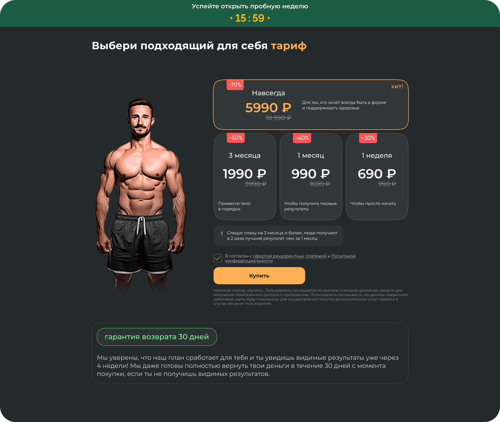
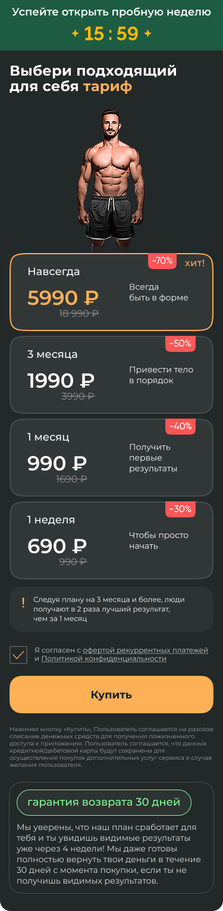
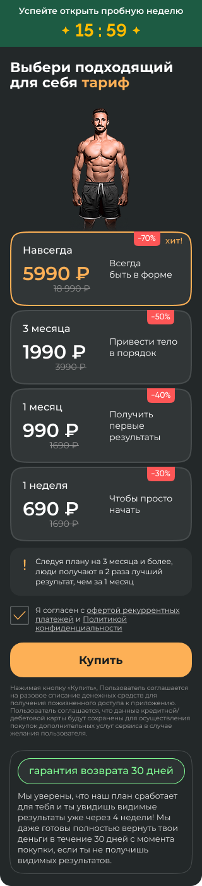

# Страница тарифов для фитнеса (Next.js)

Страница фитнес-приложения с тарифами с таймером акции и интерактивным выбором плана подписки.

<div style="display: flex; gap: 10px; align-items: center;">
 
 
 
</div>

## Стек

   

## Реализованный функционал

- Адаптивная верстка трех экранов по макету Figma (320, 375, 1920)
- Таймер обратного отсчета (2 минуты) в закрепленном хедере, красная подсветка и мигание при остатке <30 секунд
- Управление скидками: автоматическое скрытие скидок при окончании таймера, плавная анимация исчезновения скидочных цен
- Выбор тарифов: визуальное выделение выбранного тарифа, hover-эффекты на карточках
- Валидация страницы: красная подсветка чекбокса при попытке покупки без согласия

## Установка и запуск

Для установки и запуска проекта необходимо выполнить команды

```
npm install
npm run dev
```

или

```
yarn
yarn dev
```
